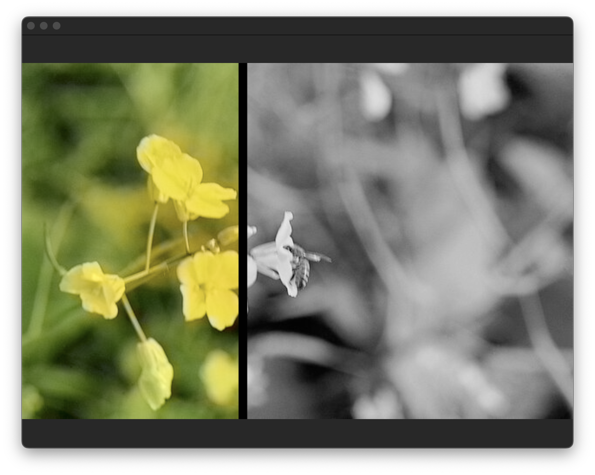

# ColorizerApp
MacOs project aim at color black and white pictures using a neural network.
More informations on how the colorization process works here :
* [Richard Zhang - Colorful Image Colorization](http://videolectures.net/eccv2016_zhang_image_colorization/)
* [Learn OpenCV - Convolutional Neural Network based Image Colorization using OpenCV](https://www.learnopencv.com/convolutional-neural-network-based-image-colorization-using-opencv/)

## project creation
⚠ Need to adapt -DCMAKE_TOOLCHAIN_FILE=/Users/rodoc/develop/vcpkg/scripts/buildsystems/vcpkg.cmake to your real vcpkg.cmake path in proj.sh file. Depends where vcpkg is installed.

```shell
cd ~
git clone https://github.com/microsoft/vcpkg.git
cd vcpkg
vcpkg install opencv4
cd ~
git clone https://github.com/rodolphe74/ColorizerApp.git
cd ColorizerApp
cd neural
7zz x model.7z.001
cd ..
./proj.sh
cd debug
make
open Colorizer.app
```

## Xcode project creation
use ./xcode.sh instead of ./proj.sh


